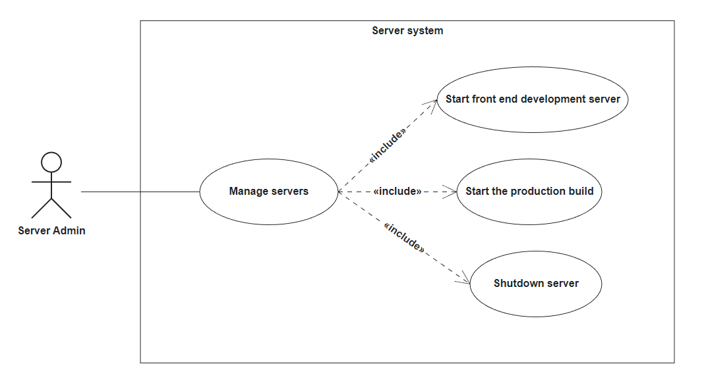

# System Design Document

## Overview

1. Introduction
    * Overview
    * Definitions, acronyms and abbreviations
    * References
2. Design Goals
3. Subsytem Decomposition
4. Hardware / Software mapping
5. Data management
6. Access control and security
7. Global software control
8. Boundary conditions

## 1. Introduction

### Overview:

The following system design document will provide an overview over the system design of the Garching Airlines Flight
Infotainment System. This SDD will describe the design goals, the system design, the software control and other
components of the software, while also providing boundary conditions and models of the system architecture.

### Definitions:

* *GAFIS*: Garching Airlines Flight Infotainment System

### References:

* Requirements Analysis Document (RAD) <!-- link later here -->
* Readme
* Source code

## 2. Design Goals

### Non-functional Requirements:

* **NFR1: Usability:** The system should be intuitive to use, and the user interface should be easy to understand. All
  interactions should be completed in less than three clicks.

* **NFR2: Conformance to guidelines:** The design of the system should conform to the typical usability guidelines such
  as Nielsen’s usability heuristics.

* **NFR3: Serversystem:** A server subsystem with a couple of services must be used in the system. However, additional
  services like destination information for weather and POIs should be obtained from external services.

### Additional design goals:

* Good Documentation, including source code documentation, RAD, SDD
* Rapid development (2 months)
* No cost (usage of free webservices and APIs)
* Fault tolerance, especially in search bars for city names

## 3. Subsytem Decomposition

<br/>
TODO
<br/>
<br/>

## 4. Hardware / Software mapping
TODO complete after subsystem decomposition is done
https://apollon.ase.in.tum.de/dBSm5MNXRDFoXYdLaDdO?view=EDIT

## 5. Data management

There is no persistent data management present in GAFIS. All data is instantiated during runtime and lost after
shutdown. The data is stored in Spring beans (objects of service classes) or in static Lists that save all created
objects of a class.

`UserService` maintains a list of all registered users (`List<User> systemUsers`), as well as if any
user is logged in (`boolean loggedIn`) and which user that is (`User loggedInUser`).

Every user also has a `List<FlightJourney>` of all the booked journeys of the user,
a `Flight currentFlight` that is the current flight of the user given to the system upon registration and
a `List<Reward>` of all received rewards for completing Surveys, as well as the unique username and password.

Additionally, there is a `static List<Location> locationList` in the Location class, which stores already
fetched locations during runtime.

Apart from that, the frontend uses `localStorage` of the page as well as a reactive global store from the
<a href="https://pinia.vuejs.org/">Pinia</a> library to have access to the logged-in user's username in order to adapt
the Home page as well as other views according to if a user is logged in or not and what is their username. This data
is fetched from the backend on startup or page refresh.

In summary, the following data is stored:

* General User data
  * `systemUsers`
  * `loggedInUser`

* Each user's data
  * `username`
  * `password`
  * `Flight currentFlight`
  * `FlightJourney` list

* Locations that have already been fetched (`static List<Location> locationList`)

* Username of currently logged-in user (client)

## 6. Access control and security

The only authentication mechanism used in GAFIS is a simple username and password login system. At startup, the user
chooses between _**Register**_ and _**Login**_ to either perform a login or make an account. When registering, the user
is prompted to choose a username and a password (the password cannot be empty), which is later used to log in. The user
data is then stored without
encryption. When the user logs in, he has to provide his username and password, which both have to be spelled correctly
in order for the user to successfully log in. The user has the ability to log out by using the _**Logout**_ button.  

The access rights change depending on whether a user is logged in or not. While the user is not logged in, he is only able to access some of the features of the system.  
Those features are:

* Watch the flight safety video
* Order food / drinks
* Watch movies

If the user is logged in into his account, he can use the follwing features:

* View current flight
* Participate in surveys
* Create flight journeys and add / remove flights to it.
* View location data, including a map with POIs
* Create POI favorites list and add / remove POIs to it.
* Watch the flight safety video
* Order food / drinks
* Watch movies

### Access matrix

|   |Flights |  Surveys | Locations  | Safety video  | Catering  | Entertainment  |
|---|---|---|---|---|---|---|
|User (logged in) | viewCurrentFlight() createFlightJourney() addFlight() removeFlight()  | participate()  | viewLocationData() createPOIList() addPOI() removePOI()  | viewSafetyVideo()  | orderFoodItem()  | watchMovie()  |
|User (logged out)  | --  | --  | --  | viewSafetyVideo()  | orderFoodItem()  | watchMovie()  |


## 7. Global software control

GAFIS uses a monolithic design and a centralized architecture. The backend server is the only master node in GAFIS and all the data is contained there. Thus, if the backend fails, the system wholly shuts down. All users have their data stored on this server.  

Futhermore, GAFIS uses the RESTful API for communicating with the server. Here, a polling-based design is used. This guarantees high performance on the client side, as the server is always accessible.  
The functionality is as follows:

1. The client needs certain data or functionality from the server.
2. The client makes a request to the server.
3. The request is processed by the server and the required processes are executed.
4. The server sends a response to the client with the resulting data.
5. The client receives the response and processes it accordingly.


## 8. Boundary conditions

There are two main compononents in GAFIS.  
The server (backend), which mainly handels the functionality of the system, the storing of data and the management of external services, is the first component.  
The client (frontend), which mainly provides a UI of the system, but is also responsible for wrapping and managing the functionality, is the second component.  

There are several ways to start / manage those components from a terminal (for developers / server administrators etc.)
<br/>
<br/>
### Start the Front-End Development Server
This has hot-reload capabilities but does not start the Spring Boot backend.

```sh
./gradlew npm_run_dev
```

open a web browser and visit `localhost:3000`

### Lint JavaScript with [ESLint](https://eslint.org/)

```sh
./gradlew npm_run_lint
```

### View the Production Build

This starts both the server and client applications but does not have hot-reload capabilities.

```sh
./gradlew bootRun
```

open a web browser and visit `localhost:8080`

### Compile the JAR file

```sh
./gradlew clean build
```

### Terminate execution
```sh
^C
```

When the execution is terminated, the server shuts down and all user and location data is erased.
<br/>
<br/>

A use case diagram of a server admin managing the servers
<br/>
<br/>
### System failures
System failures are handled by shutting down the system.


<br/>
<br/>
<br/>
<br/>
<br/>

<!--### Functional Requirements:

* **FR1: Show  flight  information:** The system shows  flight  information (flight  number, start time, end time, gate, terminal, seat, airplane type, airline, etc.) of all the user’s flightsand notifies the user if a flight is canceled or delayed.

* **FR2: Add new flight trip:** The user cansearch through available flights and can select the one’s he has booked. The user can build flight journeys (trips) with multiple connecting flights or one return flight and can see the trips on a map.

* **FR3: Display destination information:** The user can display important information such as  POIs  in  the  destination  place  (e.g., hotels,  restaurants,  attractions)  and  weather  data. POIs should be shown in a map and the user should be able to filter them. When clickingon a POI, the user can see additional information and save the POI in the favorites.
  
* **FR4: Give feedback:** A passenger can give feedback after he took the flight about the flight itself, catering, entertainment, service orcomfort. Passengers who take the survey will be rewarded, e.g.,by miles, souvenirs, coupons,or price drawings.

* **FR5: Request service:** During a flight, a passenger can request the service. This notifies the service staff so that they can come to the passenger’s seat.-->
