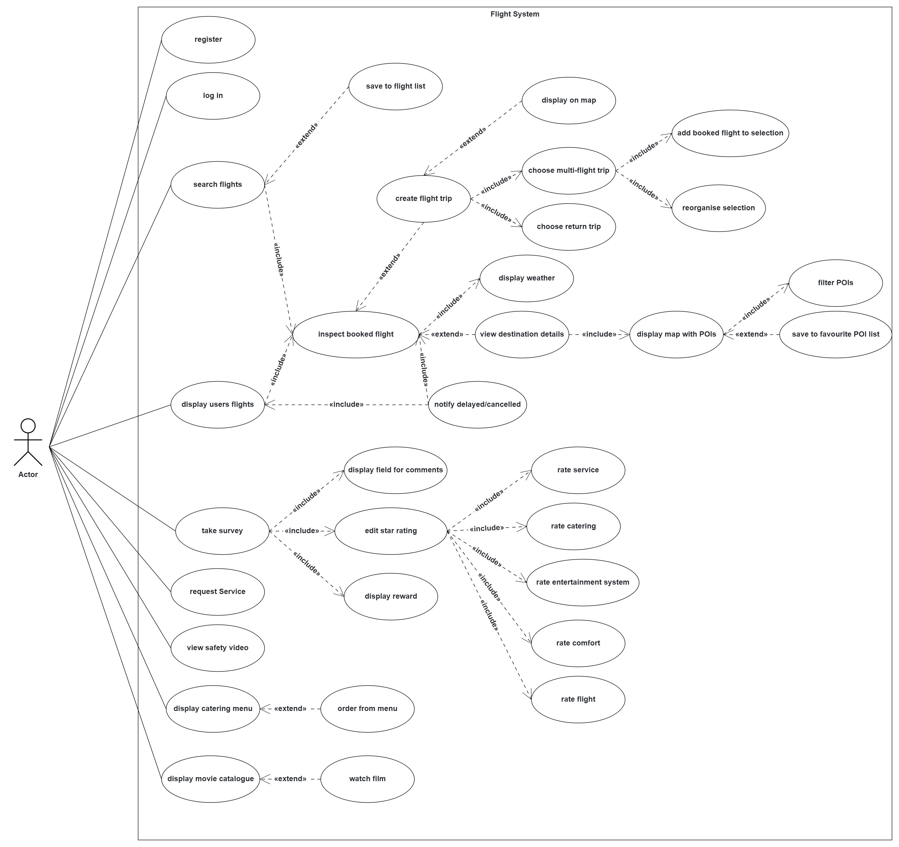
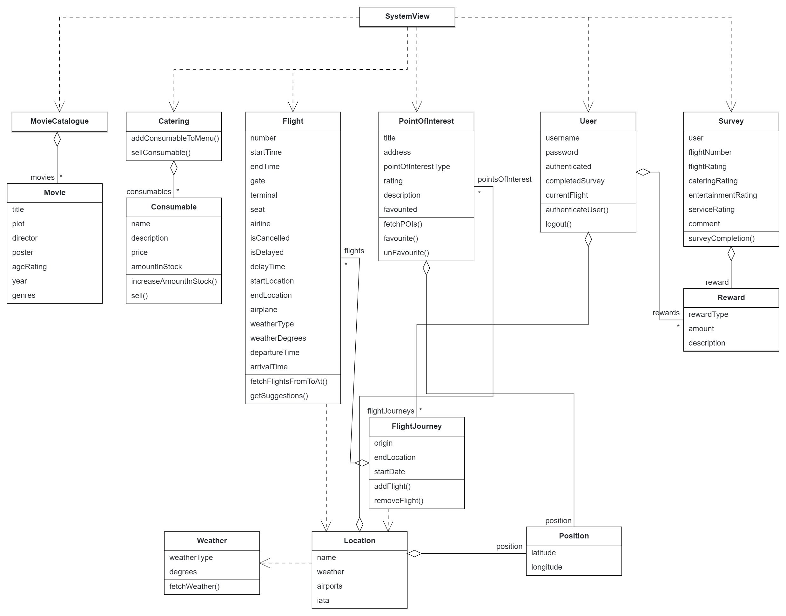
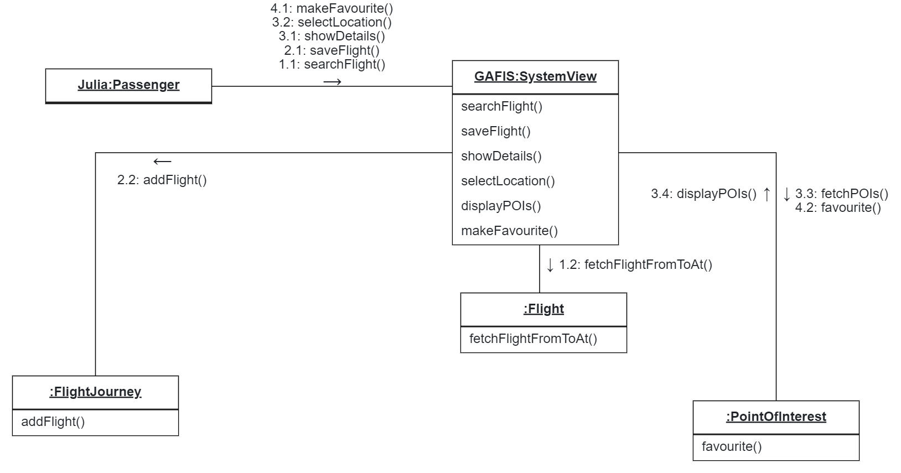

# Requirements Analysis Document

## Table of Contents

1. Introduction
    * Purpose of the system
    * Scope of the system
    * Definitions, acronyms, and abbreviations
    * References
    * Overview
2. Proposed system
    * Overview
    * Functional Requirements
    * Nonfunctional requirements
        * Usability
        * Reliability
        * Performance
        * Supportability
        * Implementation Requirements
        * Interface Requirements
        * Packaging Requirements
        * Legal Requirements
    * System models
        * Scenarios 
        * Use case model
        * Object model 
        * Dynamic model 
        * User interface 
3. Glossary

## 1. Introduction

### Purpose of the system

The purpose of the "Garching Airlines Flight Infotainment System" is to provide passengers on a flight with information about the destination and other flights and offer entertainment and service.

### Scope of the system

The scope of the system is the development of a flight entertainment system. This includes a backend where all data and input from the frontend is processed. This includes a catering service, surveys, searching and saving flights and obtaining information about the destination. The frontend takes care of the display of such information and the user input. What is not included in the scope and will be implemented via APIs are the weather information, flights and maps.

### Definitions, acronyms, and abbreviations

* *GAFIS*: Garching Airlines Flight Infotainment System
* *RAD*: Requirements Analysis Document
* *SDD*: Software Design Document

### References

* [Software Design Document (SDD)](SDD.md)
* [Readme](../README.md)
* [Source code](../src/main)

### Overview

The following RAD will give the reader an overview over the (non-)functional requirements of the system, a rough understanding of the design of GAFIS and a preview of the UI.

## 2. Proposed system

### Overview

The GAFIS is primarily a system where passengers in an airplane can search flights, obtain information about theri destination and stay entertained for the length of their journey. To achieve the goals specified via the (non-)functional requirements and scenarios we have included some models of our proposed system.

### Functional requirements

* **Show flight infomation:** The system shows flight information (flight number, start time, end time, gate, terminal, seat, airplane type, airline, etc.) of all the user's flights and notifies the user if a flight is canceled or delayed.
* **Add new flight trip:** The user can search through available flights and can select the one’s he has booked. The user can build flight journeys (trips) with multiple connecting flights or one return flight and can see the trips on a map.
* **Display destination information:** The user can display important information such as POIs in the destination place (e.g., hotels, restaurants, attractions) and weather data. POIs should be shown in a map and the user should be able to filter them. When clicking on a POI, the user can see additional information and save the POI in the favorites.
* **Give feedback:** A passenger can give feedback after he took the flight about the flight itself, catering, entertainment, service or comfort. Passengers who take the survey will be rewarded, e.g., by miles, souvenirs, coupons, or price drawings.
* **Request service:** During a flight, a passenger can request the service. This notifies the service staff so that they can come to the passenger’s seat.
* **Watch flight safety instructions:** The user can watch the flight safety instructions.

### Nonfunctional requirements

#### Usability

* The system should be intuitive to use, and the user interface should be easy to understand. All interactions should be completed in less than three clicks.
* The design of the system should conform to the typical usability guidelines such as Nielsen’s usability heuristics.

#### Reliability

* The system has to be fault tolerant to an extent, especially when searching for city names.

#### Performance

* Loading times of over 0.25 seconds should never occur when switching views.

#### Supportability

* It should be possible to add a new feature/service in approximately two weeks.
* There has to be extensive documentation including source code documentation, RAD and SDD.

#### Implementation Requirements

* A server subsystem with a couple of services must be used in the system. However, additional services like destination information for weather and POIs should be obtained from external services.
* Only the use of free webservices and APIs is allowed for the implementation of GAFIS.

#### Legal Requirements

* Media included in the entertainment system of GAFIS may not breach any copyright regulations.

### System models

#### Scenarios

* Julia bought a Lufthansa flight from Munich to Lisbon on June 5 via the Lufthansa website. She opens the system and searches all the available flights between Munich and Lisbon on June 5. She selects the flight and saves it to her flight list. When looking into the details, she recognizes that the sun is shining in Lisbon. When she clicks on Lisbon, she sees the city map with points of interest (POI) and uses a filter to see the 10 best attractions. Julia decides to visit the Belém Tower and saves it in her favorites POI list.
* Simon is currently flying from Rome to London. During the flight, he has a nice dinner with spaghetti and a beer. Then he participates in a survey: Simon is asked to rate the entertainment system and the catering. He gives both a five-star rating. Then he is asked about the comfort. Simon chooses a four-star rating, because the toilet is not clean. He describes the problem in the comment section. After he quits the survey, the system shows him a coupon for a free drink at the Burger restaurant at Heathrow airport.
* Maria is flying from Barcelona to Paris with Lufthansa. Because the steward had a strong German accent, she did not understand the safety instructions before the plane takes off. She opens the system and sees instructions on how to fasten the seatbelt, how to use the oxygen mask and how to locate the nearest emergency exit. After the plane reaches cruising altitude, she decides to watch a movie using the airplane entertainment system. While she is watching the movie, she requests a drink available on the menu

#### Use case model

#### Object model

#### Dynamic model

Scenario 1: Communication model

Scenario 2: Communication model

Scenario 3: Communication model

#### User interface

## 3. Glossary
